# 🧭 CultureQuest AI – Gamified Digital Passport & AI Heritage Assistant

[](https://www.python.org/)
[](https://opensource.org/licenses/MIT)
[](https://deepmind.google/technologies/gemini/)
[](#)

CultureQuest AI is an immersive, gamified digital travel journal designed to make learning about India's history, folklore, architecture, and traditions interactive, visually stunning, and educational. Blending modern web design with advanced generative AI, the platform acts as a real-time museum/monument tour guide and cultural companion.

---

## 🏛️ Problem Statement
In an era of rapid digitization, cultural heritage is frequently relegated to static textbooks, dry museum placards, or overwhelming Wikipedia entries. Younger generations and travelers often struggle to connect with the rich tapestry of history, folklore, and architectural genius of historical monuments. 
*   **The Gap**: Traditional tourism lacks interactive engagement, failing to provide immediate, context-aware answers or personalized learning.
*   **The Goal**: Create a zero-friction, highly engaging mobile-first platform that translates exploration into a gamified quest—rewarding curiosity with knowledge, digital visa stamps, and an interactive, multi-modal AI guide.

---

## 💡 The Solution: CultureQuest AI
CultureQuest AI transforms the learner's journey into a physical **digital passport**. As users explore India virtually via an interactive SVG map or physically by uploading photos, they unlock deep heritage archives, listen to audio-narrated folklore, and engage with our multi-modal AI Assistant.

---

## 🤖 The AI Heritage Assistant & Guide
The cornerstone of our latest release is the **AI Heritage Assistant**—a real-time multi-modal tour guide powered by Google Gemini.

```mermaid
graph TD
    A[User Uploads Image] --> B[Client downscales image preview]
    A --> C[Client posts image base64 to server.py]
    C --> D[server.py loads API Key]
    D --> E[server.py calls Gemini API with model fallback sequence]
    E --> F[Gemini recognizes monument & returns structured JSON]
    F --> G[Client renders Info Cards, Did You Know & Related Sites]
    F --> H[Save Discovery with compressed thumbnail in localStorage]
    G --> I[User asks follow-up questions / Chats with AI Guide]
    G --> J[User generates Quiz with Easy/Medium/Hard difficulty]
```



### 📸 1. Image Analysis & Monument Recognition
*   **Zero-friction upload**: Users drag, drop, or capture photos of Indian monuments, temples, artifacts, or folk art.
*   **Multi-modal detection**: The image is securely proxied through our custom gateway to Google Gemini, which identifies the monument and returns a structured JSON payload containing history, cultural significance, architectural features, and facts.
*   **Watercolor Canvas Layout**: Results are displayed in a clean, vintage parchment card layout matching the app's overall travel-journal design.

### 💬 2. Interactive Real-Time Chatbot
*   **Context-aware conversation**: Once a monument is recognized, a chatbot interface opens. Users can ask follow-up questions (e.g. *"What materials were used?"*, *"Who commissioned this?"*, *"Are there any legends about the builder?"*).
*   **Chat Logs & Memory**: The server maintains conversation context, providing coherent, historical answers formatted in cream-and-gold speech bubbles.

### 🎓 3. Dynamic Quiz Generator (with Difficulty Levels)
*   **Instant Challenge**: Clicking **"Generate Quiz"** requests the AI to construct a 5-question multiple-choice quiz based on the monument.
*   **Three Difficulty Levels**:
    *   `EASY`: Foundational lore, basic names, and famous legends.
    *   `MEDIUM`: Intermediate architectural styles, construction eras, and historical timelines.
    *   `HARD`: Scholar-level details, specific dates, detailed architectural terms, patronage, and lesser-known historical context.
*   **Acoustic Synthesizer Feedback**: Answer options play unique synthesized instrument tones: a bright **Sitar arpeggio** for correct answers and a breathy **Bansuri flute meend slide** for incorrect choices.
*   **Rewards**: Scoring 4/5 or 5/5 awards **+100 XP** and unlocks the permanent **"AI Explorer"** badge in the user's achievements.

### 💡 4. "Did You Know?" Fact Card
*   A dedicated fact card is dynamically generated alongside the monument analysis, revealing a quirky, fascinating historical anecdote or hidden legend to keep the user engaged.

### 🗺️ 5. Related Heritage Sites Engine
*   Suggests **3 similar heritage locations** in India based on the identified monument (e.g. scanning the Taj Mahal might suggest Humayun's Tomb, Bibi Ka Maqbara, or Akbar's Tomb) complete with brief descriptions to guide the user's next adventure.

### 💾 6. My Discoveries (Local History Drawer)
*   **Persistent Storage**: Analyzed monuments are saved locally in the browser's `localStorage` as part of the persistent global state.
*   **Smart Image Downscaling**: To prevent hitting the browser's 5MB localStorage limit, uploaded images are automatically downscaled via a canvas helper to a lightweight 120x120px JPEG thumbnail (<10KB) before saving.
*   **Interactive Grid & Re-loads**: Saved cards are displayed in a scrollable list. Clicking a card instantly reloads the monument results, updates chatbot context, and lets the user restart the quiz or conversation.
*   **Delete & Sync**: Includes individual card deletion controls and full profile reset sync.

---

## 🎨 Gamified Design Philosophy & Aesthetics
*   **Physical Desk Environment**: Desktop users see a centered mobile frame resting on a warm wooden desk background complete with tea cup (☕), brass compass (🧭), vintage mail stamps (✉️), and an old fountain pen (✒️) decorations.
*   **3D Book Fold Page Turns**: Page routing uses 3D perspective transforms (`rotateY`) to mimic physical book pages turning as users navigate.
*   **SVG Cartography**: The map view features hand-drawn Himalayan contours, a sea serpent/merchant ship, river paths, a custom compass rose, and brass diya pins with flickering CSS flames.
*   **Distressed Ink Visa Seals**: Passing a city quiz stamps the user's passport booklet with a geometric, color-tailored seal (shield, octagon, scalloped circular, double-circle, triangle) using multiply blending to simulate distressed ink.

---

## 🛠️ Technical Stack

### Frontend (Client-side)
*   **Language**: HTML5, Vanilla CSS3, JavaScript (ES6)
*   **Audio Synthesis**: Web Audio API (real-time wave oscillators, Low Pass filters, Gain Nodes)
*   **Speech Narration**: Web Speech API (`SpeechSynthesisUtterance` for story narration)
*   **Icons & Fonts**: Google Fonts (Cinzel, Montserrat), FontAwesome 6 (CDN)

### Backend Gateway Server
*   **Technology**: Pure Python 3 (using `http.server.BaseHTTPRequestHandler` - **Zero third-party pip dependencies**).
*   **API Client**: Standard library `urllib.request` for secure proxying.

### Artificial Intelligence & Resilience
*   **Models**: Google Gemini 2.5 Flash, Gemini 2.0 Flash, Gemini 2.5 Pro, Gemini 3.5 Flash.
*   **Resilient Fallback Sequence**: To mitigate API rate limits (`429`), temporary high demand (`503`), or server spikes, the backend implements an automatic fallback retry sequence:
    $$\text{gemini-2.5-flash} \longrightarrow \text{gemini-2.0-flash} \longrightarrow \text{gemini-2.5-pro} \longrightarrow \text{gemini-3.5-flash}$$
    If a model fails, the gateway immediately catches the exception and falls back to the next available model in the chain, ensuring uninterrupted gameplay.

---

## 📁 Project Directory Structure
```text
culturequest-india/
├── css/
│   ├── styles.css        # Base layout, booklet frames, and 3D animations
│   └── components.css    # Map, custom visa stamps, diya pins, stories, chatbot, and My Discoveries styles
├── js/
│   ├── data.js           # Static cultural database (Jaipur, Varanasi, Kolkata, Mysore, Udaipur, Ajmer)
│   └── app.js            # Synthesizers, speech engine, state, thumbnail resize, and discoveries controller
├── images/
│   └── *.png             # Watercolor explorations headers and folklore illustration assets
├── config.json.example   # Example API key configuration file
├── index.html            # Core application layout and the 10 distinct page views
├── server.py             # Pure Python gateway web server and API proxy handler
├── verify.py             # Automated test suite checking HTML structure and JS syntax
└── README.md             # Project documentation (this file)
```

---

## 💻 Installation & Setup

### Prerequisites
*   Python 3.8 or higher installed on your system.

### Steps to Run
1.  **Clone the Repository**:
    ```bash
    git clone https://github.com/Lipitak/culturequest-ai.git
    cd culturequest-ai
    ```

2.  **Configure the Gemini API Key**:
    The server looks for the API key in two places (in order of priority):
    *   **Environment Variable**:
        ```bash
        export GEMINI_API_KEY="your_actual_gemini_api_key_here"
        ```
    *   **Local Config File**:
        Create a file named `config.json` in the root directory (this file is ignored by `.gitignore` to prevent leaks):
        ```json
        {
          "GEMINI_API_KEY": "your_actual_gemini_api_key_here"
        }
        ```
        *(If no API key is found, the web interface will display a detailed setup guidance warning banner).*

3.  **Launch the Gateway Server**:
    Start the custom Python server:
    ```bash
    python3 server.py
    ```
    The server will start listening at `http://localhost:8000`.

4.  **Explore**:
    Open your browser and navigate to `http://localhost:8000`.

---

## 🔍 Automated Verification
To verify that all stylesheets, javascript files, assets, and structural page containers are linked correctly and syntactically sound, run the automated verification script:
```bash
python3 verify.py
```
This ensures zero bracket mismatch errors and a stable build status before deployments.

---

## 🚀 Future Roadmap
*   **AR Monument Scans**: Integrate WebXR to overlay 3D historical reconstructions directly on monuments when scanned through phone cameras.
*   **NFT Passport Stamps**: Mint unlocked visa stamps as eco-friendly, tradeable digital badges on a blockchain network.
*   **Multi-Lingual Narration**: Support audio timelines and AI guides in regional Indian languages (Hindi, Tamil, Bengali, Marathi, etc.) using fine-tuned regional voice synthesis.
*   **Social Travelers Lobby**: Allow users to share passport diaries, compare XP on leaderboards, and co-op explore cities together.

---

## 👥 Team & Contributions
*   **Lipitak** – Lead Frontend Engineer, Cartographer & Synthesizer Designer.
*   **Antigravity** – Autonomous AI Coding Partner, Backend Developer, and Integration Specialist.

---
*Created with 🧡 for the Heritage Hackathon.*
